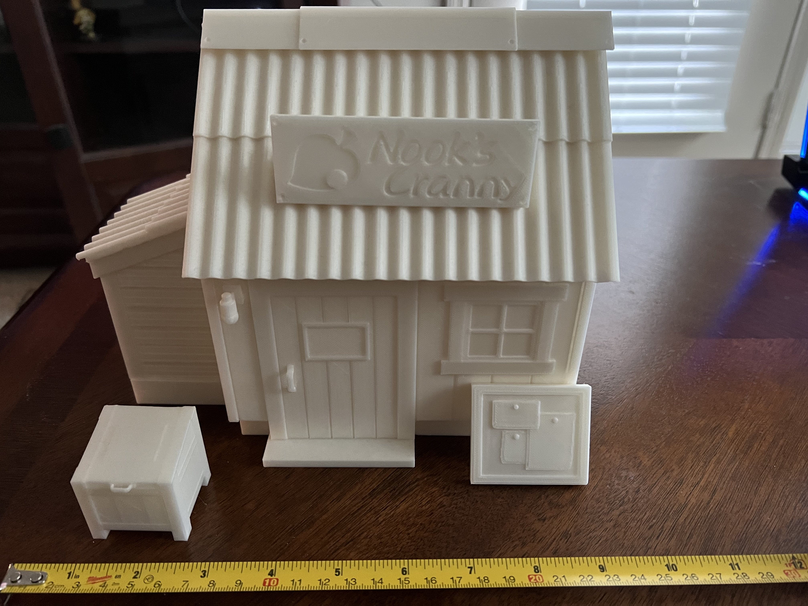
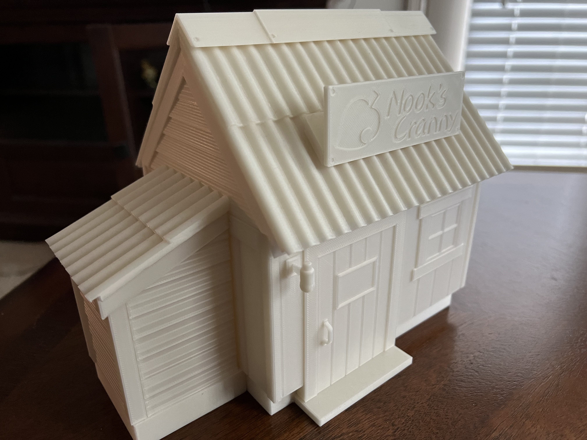
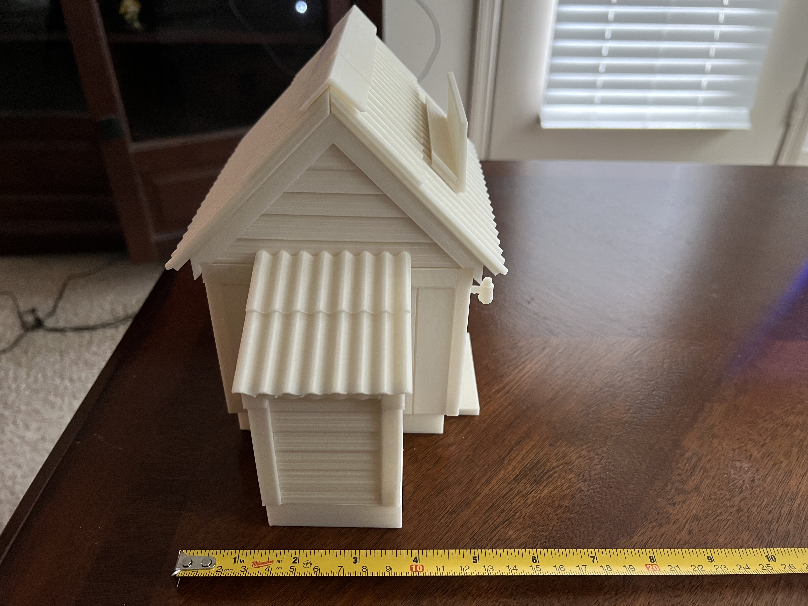
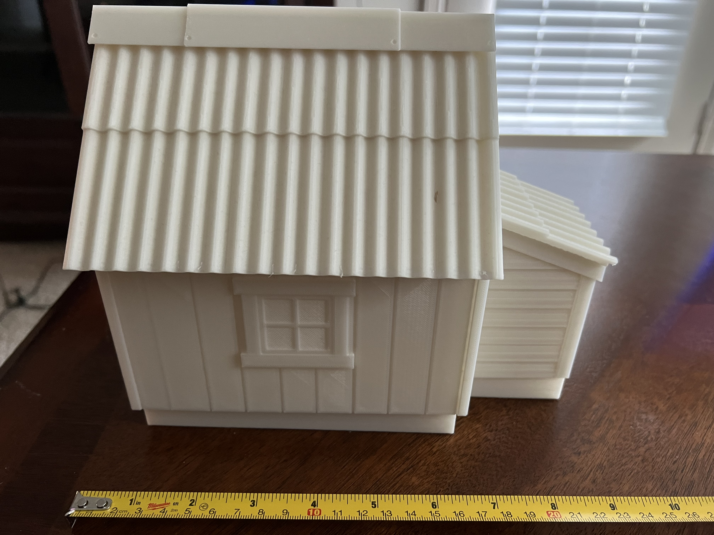
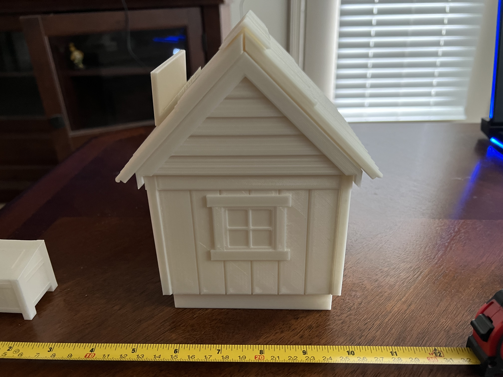

# Nook's Cranny

## About

The model was built from the ground up using [Blender](https://www.blender.org/), exported as a `.stl` file, imported into [PrusaSlicer](https://www.prusa3d.com/page/prusaslicer_424/), sliced and the result is saved as a `.gcode` file. This print was designed around it being printed on a Prusa Mini+.

> **_IMPORTANT:_** It is never recommended to print from someone elses gcode file. That is why I included the `.stl` files in this repo. I recommend you use the stl files in your slicer of choice to re-create the `.gcode` file.

## Images

## License

Creative Commons Zero v1.0 Universal [License](LICENSE)
